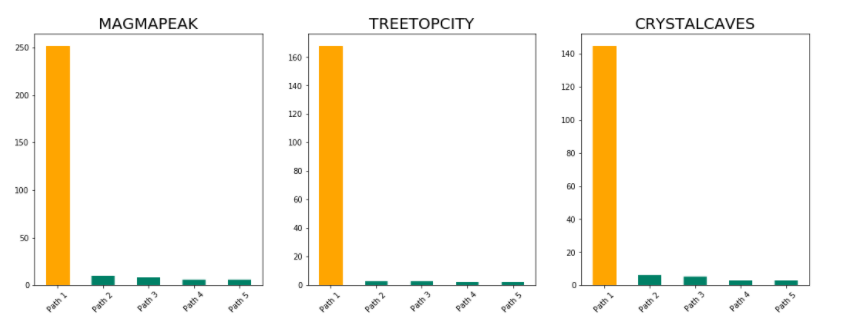

# Kaggle 2019 Data Science Bowl

[the PBS KIDS Measure Up!](https://pbskids.fandom.com/wiki/Measure_Up) 앱의 사용자 활동 데이터를 이용하여 사용자가 마지막에 수행한 평가 스테이지 성적 예측. 성적은 4개의 분류로 되어있으며, 다음과 같습니다. 

- 3: the assessment was solved on the first attempt
- 2: the assessment was solved on the second attempt
- 1: the assessment was solved after 3 or more attempts
- 0: the assessment was never solved

예측치와 실제 결과 간의 차이를 반영하는 the quadratic weighted kappa loss로 평가하였습니다.

대회 링크 : [Link](https://www.kaggle.com/c/data-science-bowl-2019/overview/description) 

### 주최

- Booz Allen Hamilton, Kaggle
- 2019.10.24 ~ 2020. 01. 16

### 결과

- 평가 SCORE : 0.537
- 브론즈 메달(상위 9%)

### 데이터

[the PBS KIDS Measure Up!](https://pbskids.fandom.com/wiki/Measure_Up) 앱의 실제 사용자 활동 데이터 : [Link](https://www.kaggle.com/c/data-science-bowl-2019/data)

### 분석 툴

- Python : `pandas`, `numpy`, `scikit-learn`, `lightgbm`, `matplotlib`, `seaborn`

### 데이터 전처리 및 생성 변수

- 데이터 크기 축소를 위한 데이터 Type 변경
- 실제 앱을 플레이하면서 발생하는 텍스트 및 음성을 기반으로 어떻게 로그가 생성되는지 분석
- 스테이지 별 플레이어의 행동 수, 시간 관련 변수 생성
- 평가 스테이지가 아니지만, 플레이어의 행동이 진행 상황에 필요한 행동인지 판단하여 관련 변수 생성
- 빈 화면을 찍거나 불필요한 구조물을 클릭하는 등의 행동 관련 변수 생성
- 각 챕터(월드)에 따라 변수 분리

### 사용 모델

- LIghtGBM with 5 fold
- KFold 외, 챕터 및 발생한 로그의 수를 기반으로 그룹화한 후 GroupKFold로 학습 데이터를 분리하는 등의 Fold 전략 사용
- Grid search 및 Bayesian Optimizer로 모델 파라미터 튜닝

### 기타

- 사용자의 스테이지 진행 순서를 분석하여 앱에서 제공하고 있는 스테이지 순서 관련 코드 공유 : [2019 DSB EDA : World and Title sequence](https://www.kaggle.com/namepen/2019-dsb-eda-world-and-title-sequence)

