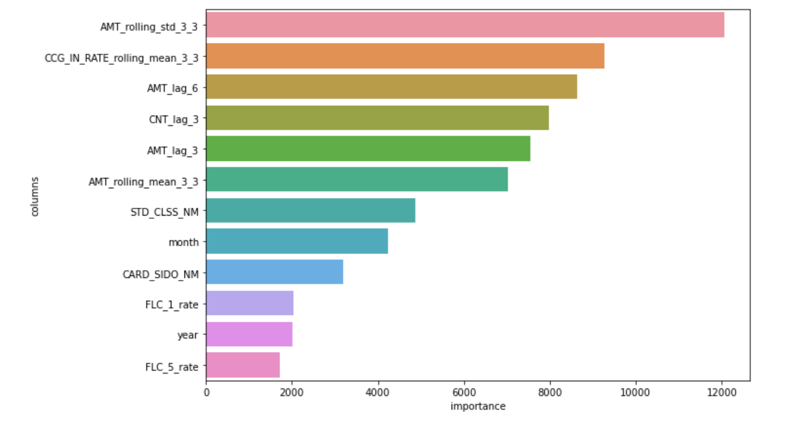

# [대회] 제주 신용카드 빅데이터 경진대회

2019.01 ~ 2020.03 기간 내 신용카드 사용 내역 데이터를 이용하여 20년 4~ 7월 사이 소비금액 예측(평가 지표 : RMSLE)

### 주최

제주특별자치도청, 데이콘

### 결과

- 평가 SCORE : 1.126
- 시각화 코드공유 1위(42 vote) : [코드 링크](https://dacon.io/competitions/official/235615/codeshare/1302?page=1&dtype=recent&ptype=pub)

### 데이터

1. [2019.01 ~ 2020.03 기간 내 신용카드 사용 내역 데이터(지역별, 성별, 생애주기가구별)](https://dacon.io/competitions/official/235615/data/)
2. [경제활동 인구](http://kosis.kr/statHtml/statHtml.do?orgId=101&tblId=INH_1DA7014S_01&vw_cd=MT_GTITLE01&list_id=106&seqNo=&lang_mode=ko&language=kor&obj_var_id=&itm_id=&conn_path=MT_GTITLE01) (국가통계포털)
3. [취업자증감수](http://kosis.kr/statHtml/statHtml.do?orgId=101&tblId=DT_1YL20541&vw_cd=MT_GTITLE01&list_id=106&seqNo=&lang_mode=ko&language=kor&obj_var_id=&itm_id=&conn_path=MT_GTITLE01) (국가통계포털)
4. [대형소매점 판매액](http://kosis.kr/statHtml/statHtml.do?orgId=101&tblId=INH_1K31005_01&vw_cd=MT_GTITLE01&list_id=109&seqNo=&lang_mode=ko&language=kor&obj_var_id=&itm_id=&conn_path=MT_GTITLE01) (국가통계포털)
5. [백화점판매액](http://kosis.kr/statHtml/statHtml.do?orgId=101&tblId=INH_1K31005_02&vw_cd=MT_GTITLE01&list_id=109&seqNo=&lang_mode=ko&language=kor&obj_var_id=&itm_id=&conn_path=MT_GTITLE01) (국가통계포털)
6. [생활물가지수](http://kosis.kr/statHtml/statHtml.do?orgId=101&tblId=DT_1YL6601E&vw_cd=MT_GTITLE01&list_id=109&seqNo=&lang_mode=ko&language=kor&obj_var_id=&itm_id=&conn_path=MT_GTITLE01) (국가통계포털)

### 분석 툴

- Python : pandas, numpy, scikit-learn, lightgbm, seaborn

### 데이터 전처리

- 지역별, 월별 소비금액 그룹화
- 이동 평균(MA)를 이용한 변수 생성
- 외부 데이터 전처리 후 변수 생성
- JensenShannon 클러스터링을 이용한 변수 생성

### 사용 모델

- 학습 데이터 : 7488 rows (89 columns)
- LIghtGBM with 6 k-fold

### 외부 데이터 효과

- LightGBM 모델 학습 시, 외부 데이터로 생성한 변수의 중요도가 높게 나타남
- 주요 변수 : 취업자 증감수, 광공업생산지수, 생활물가지수_전월세 등
- 사용 전 score : 1.506 → 사용 후 score 1.126

#

외부 데이터 사용 전 모델 feature importance

외부 데이터 사용 모델 feature importance
