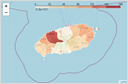

# [데이콘]공간정보 탐색적 데이터 분석

공간 정보를 활용하여 21년 5~8월까지의 제주 지역 데이터를 분석하여 다양한 인사이트 발굴

[공간정보 탐색적 데이터 분석 경진대회](https://dacon.io/competitions/official/235682/overview/)

### 주최

국토연구원, 데이콘

### 평가지표

외부 투표 + 내부 심사

### 기간

2020.12.14 ~ 2020.12.27

### 결과

- 3위 입상
- 분석 코드 : [https://dacon.io/competitions/official/235682/codeshare/2057](https://dacon.io/competitions/official/235682/codeshare/2057)

### 데이터

[제주도 소비 데이터(제공 데이터)](https://dacon.io/competitions/official/235682/data/) : 2021년 5~ 8월 소비금액 및 재난지원금 사용금액 데이터

### 분석 툴

- Python : `pandas`, `geopandas`, `numpy`, `scikit-learn`, `seaborn`, `folium`
- QGIS

### 프로젝트 상세

**1. GIS 데이터 전처리 및 시각화**

- 좌표 데이터와 경계 데이터를 이용하여 소속 지역명(행정동명) 부여
- 경계 데이터 : 공간정보 포털 읍면동(행정동) 경계
- `folium` 라이브러리를 이용하여 점좌표 및 경계좌표 지도시각화 구현

  _제주도 관광업종 분포도_             |  _제주도 관광 위기 업종 분포도_
  :-------------------------:|:-------------------------:
    |  

**2. 외부 데이터 병합**

공공데이터로 제공되는 데이터를 가공하여 대회 데이터와 병합

- 행정동별 주민등록인구 데이터, KOSIS
- 제주도 입국객수 데이터, 공항공사

**3. Jensen-Shannon Divergence를 이용한 클러스터링**

- 지역 및 업종별 매출 변화를 기준으로 세부 집단 구분을 위해 확률분포 기반의 유사도를 측정하는 Jensen-Shannon Divergence를 이용한 클러스터링 수행

_지역/업종을 매출 변화를 기준으로 클러스터링하여 세부 집단으로 분류_

**4. 주제별 분석 및 시각화 진행**

- 제주도 관광객 변화에 따른 관광업종 매출 분석 : 관광 업종 정의 및 관광객 증감에 따라 업종별 매출 변화 분석을 수행. 관광객이 증가했음에도 매출이 감소한 업종을 선정하여 관광 위기 업종으로 분류하여 지원책 마련 필요 강조.

- 지역 및 업종별 소비 분석 : 소비금액 및 소비 건수를 분석하여 제주도 내 소비 상위 업종 및 지역 등을 찾아냈으며, 상위  업종을 한정하여 시간대별 소비 패턴 변화 분석 수행

- 지역 및 업종 별 재난지원금 사용 분석

